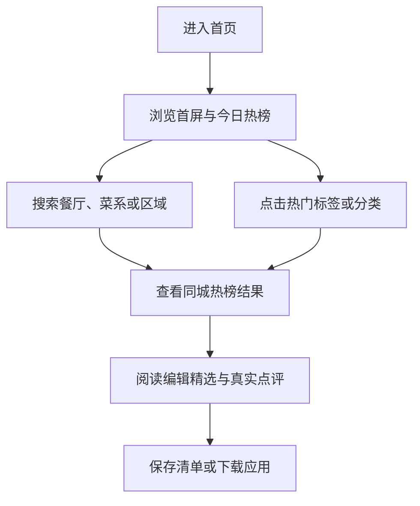

## 1. 产品概述
“饭局”是面向城市年轻人的美食推荐首页，帮助用户在约饭、探店、夜宵、早午餐等场景下快速找到可信餐厅与内容灵感。
- 主要解决“临时想吃什么、去哪家更稳、适不适合当前场景”的决策问题。
- 目标价值是以同城热榜、真实点评、编辑精选和下载转化组成完整首页体验，提升收藏、搜索与进一步使用应用的意愿。

## 2. 核心功能

### 2.1 功能模块
1. **首页导航**：品牌标识、城市入口、搜索框、快捷标签、下载应用按钮。
2. **首屏发现**：品牌主张、场景标签、主搜索、热门标签、主视觉卡片、今日热榜卡片。
3. **热门分类**：按早午餐、火锅局、小酒馆、甜点站等真实场景展示分类入口。
4. **同城热榜**：展示餐厅排名、评分、区域、人均、营业状态和适合场景。
5. **热区动态与收藏理由**：补充城市区域趋势和产品信任理由。
6. **编辑精选**：用大图内容卡和精选列表强化内容感与可分享性。
7. **真实点评**：展示用户点评、场景、推荐菜和餐厅来源。
8. **下载转化**：展示应用价值、清单保存、转发与附近补位能力。
9. **页脚信息**：城市切换、内容入口和合作信息。

### 2.2 页面详情
| 页面名称 | 模块名称 | 功能描述 |
|---|---|---|
| 首页 | 顶部导航 | 固定在页面顶部，支持搜索输入、快捷标签点击、城市提示和下载按钮反馈 |
| 首页 | 首屏发现 | 保持设计稿暖色调、圆角卡片、主视觉图片和场景搜索布局 |
| 首页 | 热门分类 | 分类卡片支持 hover 浮起、焦点态、点击选中并更新搜索意图 |
| 首页 | 同城热榜 | 列表项支持点击高亮、切榜单交互和状态标签展示 |
| 首页 | 编辑精选 | 大图精选卡与文本列表联动，突出“本周精选”和可预订等标签 |
| 首页 | 真实点评 | 用户点评卡片展示头像、场景、文案与推荐菜标签 |
| 首页 | 下载转化 | 下载、订阅按钮触发轻量反馈，下载清单卡片支持保存态 |
| 首页 | 页脚 | 内容入口可滚动定位到对应页面区域 |

## 3. 核心流程
用户进入首页后，先通过首屏了解“饭局”的定位，再通过搜索、标签、热门分类或同城热榜缩小选择；当用户对内容产生兴趣时，可查看编辑精选与真实点评增强信任，最后通过下载应用或订阅榜单完成转化。

## 4. 用户界面设计

### 4.1 设计风格
- **主色**：暖橙红 `#ef5a37`，用于按钮、重点标签、评分与状态强调。
- **背景**：奶油暖白 `#fffaf6`，叠加右上角柔和径向光晕，营造温暖食欲感。
- **卡片**：白色或浅橙白底，`16px` 大圆角，细描边，轻阴影，强调内容层次。
- **字体**：中文优先使用 `Noto Sans SC` / `PingFang SC`；标题粗重、紧凑，正文保持舒适行高。
- **图标**：使用 Lucide 风格线性图标，搭配实色暖橙方形图标容器。
- **动效**：卡片 hover 轻微上移，按钮颜色过渡，详情标签渐入，页面加载分段淡入。

### 4.2 页面设计概览
| 页面名称 | 模块名称 | UI 元素 |
|---|---|---|
| 首页 | 顶部导航 | 毛玻璃固定导航、品牌图标、城市按钮、搜索框、横向快捷标签 |
| 首页 | 首屏发现 | 大标题、说明文案、场景标签、搜索卡片、主视觉大图、榜单摘要 |
| 首页 | 热门分类 | 四宫格分类卡、图标容器、说明文案、场景标签 |
| 首页 | 同城热榜 | 左侧榜单卡、右侧趋势卡与收藏理由卡 |
| 首页 | 编辑精选 | 图文混排大卡、精选列表、价格和时间标签 |
| 首页 | 真实点评 | 三列点评卡、圆形头像、场景副标题、推荐菜标签 |
| 首页 | 下载转化 | 暖橙浅底 CTA、按钮组、应用内清单样式卡片 |
| 首页 | 页脚 | 四列信息区、城市标签、内容入口按钮 |

### 4.3 响应式
- **桌面端优先**：最大内容宽度 `1200px`，双栏首屏、四列分类、三列点评。
- **平板端**：首屏变为单列或两列，分类变双列，图片高度适当降低。
- **移动端**：顶部导航堆叠，标签横向滚动，所有主内容单列展示，按钮保持可触控高度。
- **触控优化**：按钮和可点击卡片最小高度不低于 `44px`，横向标签隐藏滚动条。

## 5. 交互补充
- 搜索框输入后可显示轻量提示，并将关键词同步到推荐状态。
- 热门标签、分类卡和榜单切换按钮支持选中态，反馈当前筛选场景。
- 城市按钮可弹出城市选择面板，默认包含上海、杭州、南京、北京、广州。
- 下载应用、订阅榜单、保存清单等按钮触发 toast 提示。
- 页脚内容入口支持平滑滚动到对应模块。
- 所有交互元素提供键盘焦点态和 `prefers-reduced-motion` 降级。
