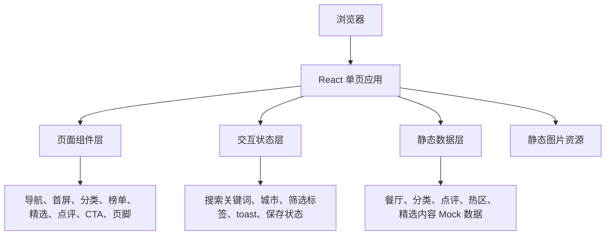

## 1. 架构设计



## 2. 技术描述
- **前端**：React@18 + TypeScript + Vite。
- **样式**：Tailwind CSS@3 + CSS Variables，复刻设计稿中的暖色主题、圆角、卡片、响应式栅格与动效。
- **图标**：lucide-react，保持设计稿中线性图标风格。
- **动画**：CSS transition 与页面进入动画，避免引入额外动画依赖。
- **后端**：无后端，使用本地 Mock 数据驱动完整页面。
- **资源**：复用上传设计稿中的两张 JPG 素材，放入 `src/assets/`。
- **构建**：`npm run dev` 本地预览，`npm run build` 生产构建。

## 3. 路由定义
| 路由 | 用途 |
|---|---|
| `/` | “饭局”美食推荐首页，包含所有模块与交互 |

## 4. 组件规划
| 组件 | 职责 |
|---|---|
| `App` | 页面状态管理、toast、模块组装 |
| `Header` | 固定导航、城市入口、顶部搜索和快捷标签 |
| `HeroSection` | 首屏文案、主搜索、热门标签、主视觉与前三榜单 |
| `CategorySection` | 热门分类入口与筛选反馈 |
| `RankingSection` | 同城热榜列表、切榜单与热区动态 |
| `EditorsPickSection` | 编辑精选大卡与小卡列表 |
| `ReviewSection` | 真实点评卡片 |
| `DownloadSection` | 下载 CTA、订阅和清单保存交互 |
| `Footer` | 城市、内容入口、合作信息 |
| `Toast` | 轻量操作反馈 |

## 5. 数据模型

```ts
type Restaurant = {
  id: string;
  name: string;
  area: string;
  score: number;
  price: string;
  status: "营业中" | "排队中" | "营业至 24:00" | "深夜友好";
  scene: string;
  description: string;
  tags: string[];
};

type Category = {
  id: string;
  title: string;
  icon: string;
  description: string;
  tags: string[];
};

type Review = {
  id: string;
  user: string;
  avatar: string;
  scene: string;
  title: string;
  content: string;
  restaurant: string;
  recommend: string;
};
```

## 6. 状态与交互
- `selectedCity`：城市选择，默认上海。
- `keyword`：搜索关键词，顶部搜索和首屏搜索可共享或分别触发提示。
- `activeTag`：当前选中的热门标签或分类，用于高亮与 toast 反馈。
- `savedItems`：下载转化区域的清单保存状态。
- `toastMessage`：按钮点击、订阅、下载、切榜单和保存操作的轻量反馈。

## 7. 样式策略
- 使用 `:root` 保存设计稿颜色、圆角、阴影、字体和容器宽度变量。
- Tailwind 负责布局、间距、响应式断点和常用状态。
- 全局 CSS 提供 `surface-card`、`soft-card`、`chip`、`primary-button`、`outline-button`、`interactive-card` 等复用类。
- 保留设计稿中的浅色主题，同时预留 `.dark` 变量，便于后续扩展暗色模式。
- 图片使用本地静态资源，配置 `object-cover` 和响应式高度保持视觉比例。

## 8. 性能与可访问性
- 首页资源体量小，无远程 API，首屏可快速渲染。
- 图片设置明确 `alt` 文案，交互按钮使用语义化 `button`。
- 支持键盘焦点态、按钮可触控面积、减少动效偏好。
- 避免布局依赖 iframe 或 CDN 运行时，保证项目离线可构建。
